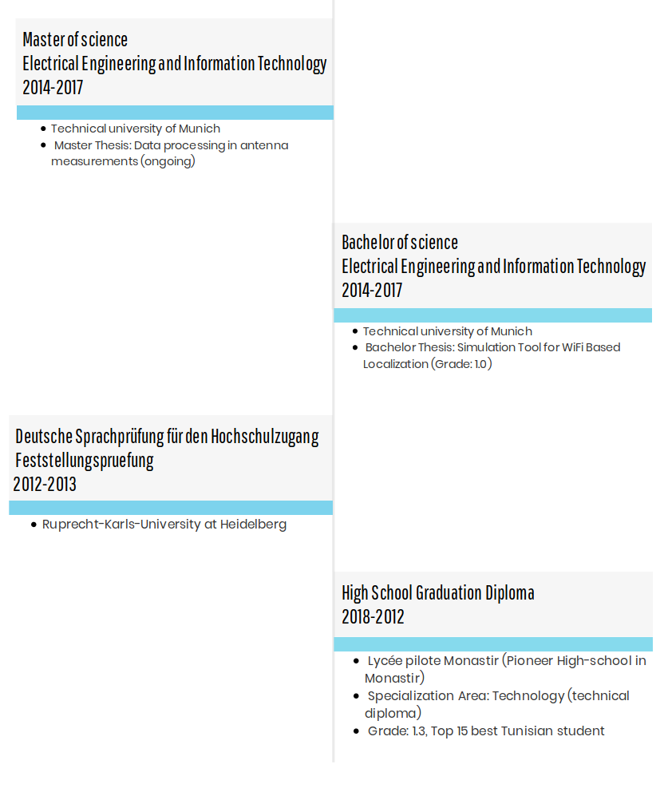

Education
============

Overview
~~~~~~~~~~~

Bachelor thesis abstract
~~~~~~~~~~~~~~~~~~~~~~~~~
Due to limitations of current localization systems in indoor environments and inability to accurately compare the existing technologies, comes the need for a simulation tool. Such a simulation would provide a platform for comparing the performances of various technologies and algorithms. This would speed up the data  collection process and facilitate the improvement of indoor localization techniques. A particular localization technology stands out thanks to its heavy existing infrastructure, which is the Wireless Based Indoor Localization (WBIL). WBIL can achieve a good compromise between cost and accuracy. Hence is the aim of this thesis to develop a simulation platform for WiFi based localization to test different methods on a common platform and explore their possibilities of improvement.

Keywords:
Wireless Indoor Localization, WiFi Simulation Tool, Delays, Signal strength, Triangulation, Fingerprinting, Ray-tracing

=================================================================================

Master thesis abstract
~~~~~~~~~~~~~~~~~~~~~~~~~
tbd
