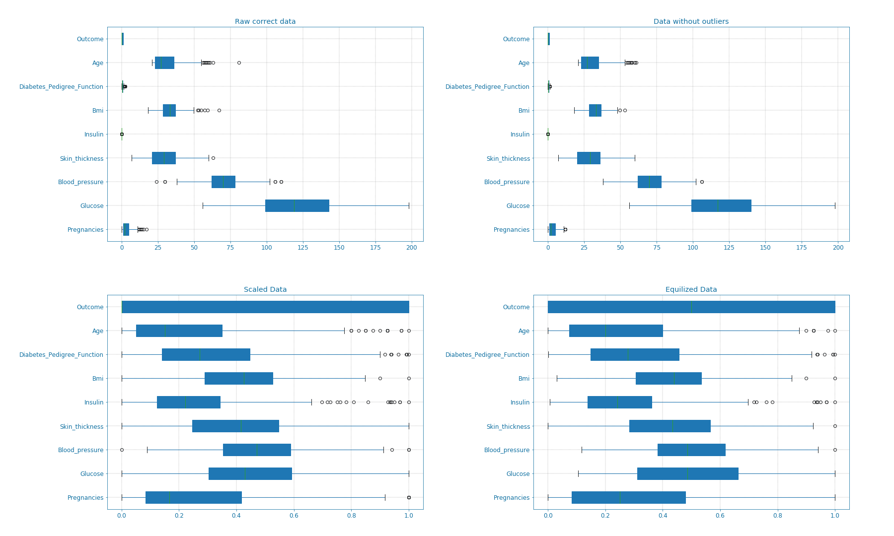
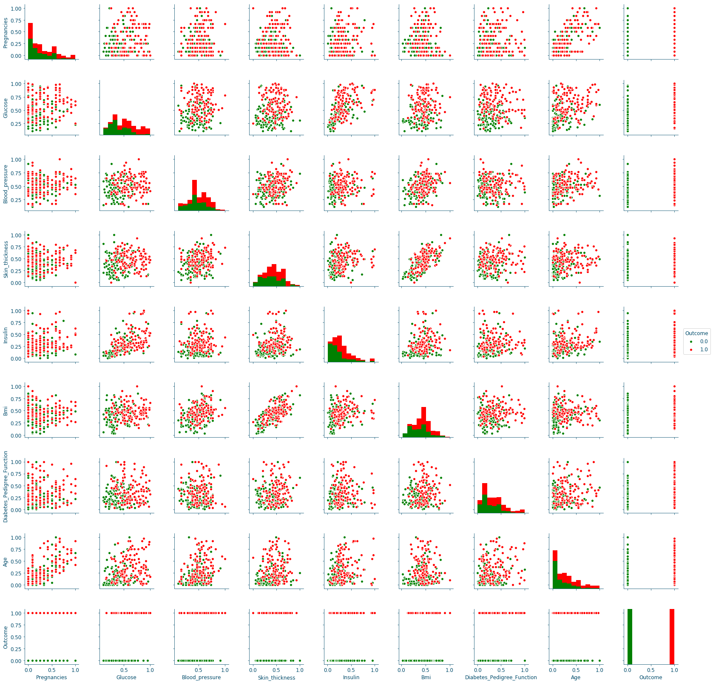

[30-06-2019] Diabetes detection using machine learning (part I)
================================================================

.. meta::
   :description: applied machine learning to diabetics detection
   :keywords: machine learning, Pima, diabetes, scikit-learn, data processing, sklearn, classification, data scaling, knn, svc, gaussian, Ayoub Malek
   :author: Ayoub Malek

.. post:: Jun 30, 2019
   :tags: [Machine learning],[Data processing],[Visualization]
   :category: Machine learning
   :author: Ayoub Malek
   :location: Munich
   :language: English

-----------------------

Diabetes is one of the most serious health challenges today.
The publicly available Pima Indian diabetic database (PIDD_) have become a popular approach for testing the efficiency of machine learning algorithms [1]_.
Within this context, this blog post is part of 2 posts providing an in depth introduction to diabetes detection using various machine learning approaches.
In this first post in particular, we focus on exploring the data at hand and preparing it for machine learning related processing.

.. raw:: html

  <ul>
  <li>The dataset can be Downloaded from   <a href="https://github.com/SuperKogito/Diabetes-detection-using-machine-learning" title="vbgr"><i class="fa fa-database"></i>here</a>. </li>
  <li> The code related to this blog can be found under <a href="https://github.com/SuperKogito/Diabetes-detection-using-machine-learning" title="vbgr"><i class="fa fa-github"></i> Diabetes detection</a>. </li>

  <table align="center" style="width:100%">
    <tr>
        <th> <a class="github-button" href="https://github.com/SuperKogito/Diabetes-detection-using-machine-learning/subscription" data-size="large" data-show-count="true" aria-label="Watch SuperKogito/Diabetes-detection-using-machine-learning on GitHub">Watch</a> </th>
        <th> <a class="github-button" href="https://github.com/SuperKogito/Diabetes-detection-using-machine-learning" data-size="large" data-show-count="true" aria-label="Star SuperKogito/Diabetes-detection-using-machine-learning on GitHub">Star</a></th>
        <th> <a class="github-button" href="https://github.com/SuperKogito/Diabetes-detection-using-machine-learning/fork" data-size="large" data-show-count="true" aria-label="Fork SuperKogito/Diabetes-detection-using-machine-learning on GitHub">Fork</a> </th>
        <th> <a class="github-button" href="https://github.com/SuperKogito/Diabetes-detection-using-machine-learning/archive/master.zip" data-size="large" aria-label="Download SuperKogito/Diabetes-detection-using-machine-learning on GitHub">Download</a></th>
        <th> <a class="github-button" href="https://github.com/SuperKogito" data-size="large" data-show-count="true" aria-label="Follow @SuperKogito on GitHub">Follow @SuperKogito</a> </th>
    </tr>
  </table>
  
  </ul>

The Pima Indian diabetic database
----------------------------------
The Pima Indian diabetes database (Download_link_), donated from the National_Institute_of_Diabetes_and_Digestive_and_Kidney_Diseases_, is a collection of medical diagnostic reports including information (9  numeric variables)
on 768 female patients (with ages between 21 and 81) of Pima_ Indian heritage (a native American population living near Phoenix, Arizona, USA) [2]_.
The database includes the following information [3]_ [4]_ :

(1) Pregnancies: Number of times pregnant
(2) Glucose: 2-Hour plasma glucose concentration in an oral glucose tolerance test
(3) BloodPressure: Diastolic  blood  pressure (:math:`mmHg`)
(4) SkinThickness: Triceps skin fold thickness (:math:`mm`)
(5) Insulin: 2-Hour serum insulin (:math:`\frac{\mu\text{U}}{ml}`)
(6) BMI: Body mass index (BMI :math:`\frac{weight~[kg]}{height^2~[m^2]}`)
(7) DiabetesPedigreeFunction: Diabetes  pedigree  function
(8) Age: Female age (:math:`years`)
(9) Outcome: Diabetes onset within 5 years (0 = No diabetes: green, 1 = diabetic: red).

>>> The goal is to predict the diabetic diagnosis (#9) using the available 8 features (#1-#8).

Data exploration
^^^^^^^^^^^^^^^^^
First, we start by loading our data and using pandas.DataFrame.describe_ to get a nice description of the data at hand.

.. code-block:: python
  :caption: Code snippet I
  :name: Code snippet I
  :linenos:

  import pandas as pd

  # define column names
  column_names = ["Pregnancies",                "Glucose", "Blood_pressure",
                 "Skin_thickness",             "Insulin", "Bmi",
                 "Diabetes_Pedigree_Function", "Age",     "Outcome"]
  # load data
  data = pd.read_csv('diabetes.csv', names = column_names)
  print(data.describe())

.. code-block:: python
  :caption: Output I
  :name: Output I

          Pregnancies     Glucose  Blood_pressure  Skin_thickness     Insulin  \
   count   768.000000  768.000000      768.000000      768.000000  768.000000
   mean      3.845052  120.894531       69.105469       20.536458   79.799479
   std       3.369578   31.972618       19.355807       15.952218  115.244002
   min       0.000000    0.000000        0.000000        0.000000    0.000000
   25%       1.000000   99.000000       62.000000        0.000000    0.000000
   50%       3.000000  117.000000       72.000000       23.000000   30.500000
   75%       6.000000  140.250000       80.000000       32.000000  127.250000
   max      17.000000  199.000000      122.000000       99.000000  846.000000

                 Bmi  Diabetes_Pedigree_Function         Age     Outcome
   count  768.000000                  768.000000  768.000000  768.000000
   mean    31.992578                    0.471876   33.240885    0.348958
   std      7.884160                    0.331329   11.760232    0.476951
   min      0.000000                    0.078000   21.000000    0.000000
   25%     27.300000                    0.243750   24.000000    0.000000
   50%     32.000000                    0.372500   29.000000    0.000000
   75%     36.600000                    0.626250   41.000000    1.000000
   max     67.100000                    2.420000   81.000000    1.000000

Improving data quality
^^^^^^^^^^^^^^^^^^^^^^^
From the previous output help we can deduce that there are no missing values (all columns include 768 value).
However,  we notice some unrealistic values (it seems that someone replaced missing  values with zeros ) in the data [1]_.
For example: a Bmi = 0 means that the person either has an infinite height or a zero weight, which is not physically possible.

These errors are summarized in the following:

- 5   patients with a glucose of 0.
- 11  patients with a body mass index  of  0.
- 35  patients  with  a  diastolic  blood  pressure  of  0.
- 227 patients  with a skin  fold  thickness  readings  of  0.
- 374 patients  with  serum  insulin  levels  of  0.

Although, these values can be reconstructed (using K-nearest neighbor algorithm assuming the data from patients with similar features follow the same pattern) but I opted for dropping rows including faulty data, which results in a database with only 392 case (no  missing  values).
The previous pre-processing is done using the following code:

.. code-block:: python
  :caption: Code snippet II
  :name: Code snippet II
  :linenos:

  import pandas as pd

  def drop_column_values(data, column_name, value):
      '''
      Delete certain dataframe rows based on the value of a certain column element
      '''
      # Get names of indexes for which column Age has value 30
      indices = data[ data[column_name] == value ].index

      # Delete these row indexes from dataFrame
      data.drop(indices , inplace = True)

  # drop erroneous rows
  for cname in ['Glucose', 'Blood_pressure', 'Skin_thickness', 'Insulin', 'Bmi']:
      drop_column_values(data, cname, 0)

  print(data.describe())

.. code-block:: python
  :caption: Output II
  :name: Output II

          Pregnancies     Glucose  Blood_pressure  Skin_thickness     Insulin  \
   count   392.000000  392.000000      392.000000      392.000000  392.000000
   mean      3.301020  122.627551       70.663265       29.145408  156.056122
   std       3.211424   30.860781       12.496092       10.516424  118.841690
   min       0.000000   56.000000       24.000000        7.000000   14.000000
   25%       1.000000   99.000000       62.000000       21.000000   76.750000
   50%       2.000000  119.000000       70.000000       29.000000  125.500000
   75%       5.000000  143.000000       78.000000       37.000000  190.000000
   max      17.000000  198.000000      110.000000       63.000000  846.000000

                 Bmi  Diabetes_Pedigree_Function         Age     Outcome
   mean    33.086224                    0.523046   30.864796    0.331633
   std      7.027659                    0.345488   10.200777    0.471401
   min     18.200000                    0.085000   21.000000    0.000000
   25%     28.400000                    0.269750   23.000000    0.000000
   50%     33.200000                    0.449500   27.000000    0.000000
   75%     37.100000                    0.687000   36.000000    1.000000
   max     67.100000                    2.420000   81.000000    1.000000

Now that only correct data values are available, we notice the presence of various outliers.
These outliers can result in faulty predictions later on. Therefore, we try to eliminate these outliers using the Z-statics.
Moreover, for the algorithm each column represents a feature and high variance and scaling difference can have a negative on the predictions.
Therefore, it is advised to scale the data, which will speed the system and improve its accuracy.
There are different ways of doing this, here I choose to first convert the Insulin values as they are way bigger than the others.
So instead of using (:math:`\frac{\mu\text{U}}{ml}`), we convert to (:math:`\frac{\text{nU}}{ml}`).
On top, we scale all the data and map it to a (0, 1) interval.
Finally, we notice that we have more samples describing the 0 outcome than samples for the 1 outcome.
This might result in better detection for the 0 outcome. To keep things balanced, I decide to equalize the dataset and use an equal number of samples for both cases.
In code this looks like the following:

.. code-block:: python
  :caption: Code snippet III
  :name: Code snippet III
  :linenos:

  # plot raw data
  fig = plt.figure(figsize = (20, 12))
  plt.subplots_adjust(left = 0.12, right = 0.95, bottom = 0.05, top = 0.95,
                      wspace = 0.35, hspace = 0.25)
  plt.subplot(2, 2, 1)
  plt.title('Raw correct data')
  data.boxplot(vert = False, labels = column_names, patch_artist = True)

  # remove outliers and plot results
  plt.subplot(2, 2, 2)
  plt.title('Data without outliers')
  data['Insulin'] = data['Insulin'] * .001
  data            = data[(np.abs(stats.zscore(data)) < 3).all(axis=1)]
  data.boxplot(vert = False, labels = column_names, patch_artist = True)

  # scale data and plot results
  plt.subplot(2 , 2, 3)
  plt.title('Scaled Data')
  scaler = MinMaxScaler(feature_range=(0, 1))
  data   = pd.DataFrame(scaler.fit_transform(data.values),  columns = column_names)
  data.boxplot(vert = False, labels = column_names, patch_artist = True)

  # equilize data and plot results
  plt.subplot(2, 2, 4)
  plt.title('Equilized Data')
  data = equalize_data(data)
  data.boxplot(vert = False, labels = column_names, patch_artist = True)
  plt.show()

The effects of the aforementioned transformations can be seen in the following box-plots (Box_plot_):

.. raw:: html

   

   
<a href="../figures/fig7.html" >Figure 7: Box-plots for data transformation </a> 

   

|

We can also visualize the balance in the data using bar and pie plots as shown in the next figure.
These manipulations though improved the data but it also limited the dataset. The new dataset only includes 115x2 = 230 samples.

.. code-block:: python
  :caption: Code snippet IV
  :name: Code snippet IV

  def plot_overview( data):
      '''
      Plot Equalized samples overview
      '''
      f, ax = plt.subplots(1, 2, figsize = (15, 7))
      outcome = data.Outcome.value_counts()
      f.suptitle("Samples count and percentage based on outcome", fontsize = 18.)
      outcome.plot.bar(ax = ax[0], rot = 0, color = ('r', 'g')).set(xticklabels = ["Outcome = 0", "Outcome = 1"])
      outcome.plot.pie(labels = ("Outcome = 0", "Outcome = 1"),
                      autopct = "%.2f%%", label = "", fontsize = 13.,
                      ax = ax[1], colors = ('r', 'g'), wedgeprops = {"linewidth": 1.5, "edgecolor": "#F7F7F7"})
      ax[1].texts[1].set_color("w")
      ax[1].texts[3].set_color("w")

  plot_overview(data)

.. image:: ../_static/blog-plots/diabetes-ml/original/samples_overview.png
   :align: center
   :scale: 80%

.. raw:: html

   

   
<a href="../figures/fig8.html" >Figure 8: Data overview </a> 

   

|

The previously discussed transformations are used to remove possible bias in the data and improve its quality.
However, if used improperly, it may deteriorate the detection quality. the question of which transformations to apply is dependent on the data nature, and the features correlation and distribution.

Features overview
^^^^^^^^^^^^^^^^^^^
Now that we cleaned the data, let us examine the available features closely. For that, we look at the bars and densities charts generated using DfPlotter.py (Github link to come later).
This should help build some intuitions and observations related to the features interactions.

.. image:: ../_static/blog-plots/diabetes-ml/original/bars.png
   :align: center
   :scale: 80%

.. raw:: html

   

   
<a href="../figures/fig9.html" >Figure 9: Bar-plots for the different features </a> 

   

.. image:: ../_static/blog-plots/diabetes-ml/original/densities.png
  :align: center
  :scale: 80%

.. raw:: html

  

  
<a href="../figures/fig10.html" >Figure 10: Densities of the different features </a> 

  

|

From these plots alone, we can already confirm some known facts such as:

- With age the chances of having diabetes are higher.
- With low responsiveness to insulin, the chances of diabetes are high.

Correlation and features selection
^^^^^^^^^^^^^^^^^^^^^^^^^^^^^^^^^^^

Correlation_ is a numerical coefficient representing the dependence between two features.
It is a very useful metric, that helps rank the available features importance.
In many systems, not all the features are relevant or at least some are redundant and leaving them out is a better option for speed or even accuracy reasons.
Think of it as a similarity metric: if two features are highly correlated so they embody the same information and consequently you can drop one of them.
Using the DfPlotter.py (Github link to come later) script, we compute & visualize the correlations matrix and the the pai-plots related to the data.

.. image:: ../_static/blog-plots/diabetes-ml/original/corr.png
    :align: center
    :scale: 50%

.. raw:: html

    

    
<a href="../figures/fig11.html" >Figure 11: Correlation matrix </a> 

    

|

When it comes to correlation coefficients:  bigger coefficient mean more dependence between the features.
The correlation's matrix is a symmetric matrix with a diagonal of ones, since a feature/variable is totally correlated with itself.
In our example, we can conclude from the last row that the outcome is mostly dependent on the following features in order: Glucose (0.52), Insulin (0.38),  Age (0.38) and Bmi (0.28).
However, if we are settling only for 3 features; choosing the first 3 might not be the best option since Glucose and Insulin are highly correlated (0.59).
Therefore, a better choice would be to take:  Glucose (0.52), Age (0.38) and Bmi (0.28). This will be further discussed in [insert knn post name].

.. raw:: html

  

  
<a href="../figures/fig12.html" >Figure 12: Distributions scatter-plots </a> 

  

|

The pair plots confirm the previous results, since the only curves with some separation between data points are in the Glucose row, in particular the ones on the columns of the Skin_thickness and the Bmi.

Conclusion
-------------------
This 1st plot from a series of 3 provided an elaborate explanation of data manipulation techniques, their use and reasons to use them.
From the raw dataset we retrieve a balanced, scaled and correct number of samples, that we later explored the mechanics regulating its features.
We will explore all these results to build a robust detection system in the next post.

References and Further readings
--------------------------------

.. [1] Rahmat Zolfaghari, Diagnosis of Diabetes in Female Population of Pima Indian Heritage with Ensemble of BP Neural Network and SVM, IJCEM International Journal of Computational Engineering & Management, Vol. 15 Issue 4, July 2012, paper_
.. [2] Pima Indians Diabetes Database, PIMA_DB_
.. [3] Igor Shvartser, Jason Brownlee, Case Study: Predicting the Onset of Diabetes Within Five Years (part 1 of 3), March 2014, case_study_predicting_the_onset_of_diabetes_within_five_years_part_1_of_3_
.. [4] Kaggle, Pima Indians Diabetes Database: Predict the onset of diabetes based on diagnostic measures, https://www.kaggle.com/uciml/pima-indians-diabetes-database
.. [5] Kaggle kernals, Pima Indians Diabetes Database: Predict the onset of diabetes based on diagnostic measures, https://www.kaggle.com/uciml/pima-indians-diabetes-database/kernels

.. _case_study_predicting_the_onset_of_diabetes_within_five_years_part_1_of_3 : https://machinelearningmastery.com/case-study-predicting-the-onset-of-diabetes-within-five-years-part-1-of-3/
.. _here : https://github.com/SuperKogito/Diabetes-detection-using-machine-learning/blob/master/diabetes.csv
.. _pandas.DataFrame.describe : https://pandas.pydata.org/pandas-docs/stable/reference/api/pandas.DataFrame.describe.html
.. _PIDD : https://raw.githubusercontent.com/jbrownlee/Datasets/master/pima-indians-diabetes.names
.. _National_Institute_of_Diabetes_and_Digestive_and_Kidney_Diseases : https://www.niddk.nih.gov/
.. _Download_link : https://www.kaggle.com/uciml/pima-indians-diabetes-database
.. _Pima : https://en.wikipedia.org/wiki/Pima_people
.. _Box_plot : https://en.wikipedia.org/wiki/Box_plot
.. _Correlation : https://en.wikipedia.org/wiki/Correlation_and_dependence
.. _Diabetes_detection_using_machine_learning : https://github.com/SuperKogito/Diabetes-detection-using-machine-learning
.. _PIMA_DB : https://raw.githubusercontent.com/jbrownlee/Datasets/master/pima-indians-diabetes.names
.. _paper : https://www.ijcem.org/papers072012/ijcem_072012_22.pdf

.. |img1| image:: ../_static/github.png
   :target: https://github.com/SuperKogito/Diabetes-detection-using-machine-learning
   :scale: 65%
