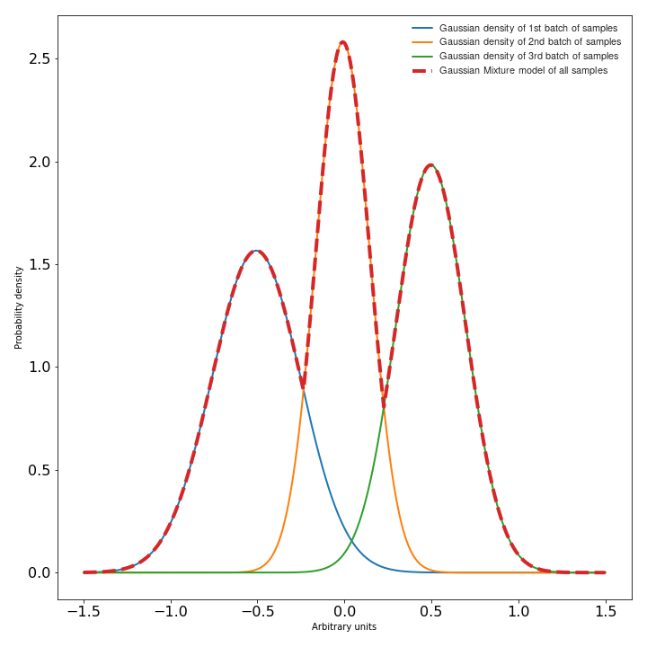

:og:description: Voice based gender recognition post
:og:keywords: Gender recognition by voice, Voice based gender recognition, Gaussian mixture model, gender classification, Ayoub Malek
:og:image: ../../../../_static/meta_images/voice_based_gender_recognition.png
:og:image:alt: voice_based_gender_recognition

Voice based gender recognition using Gaussian mixture models
============================================================

.. post:: May 09, 2019
   :tags: Audio, Voice, GMM, Python
   :category: Machine learning
   :author: Ayoub Malek
   :location: Munich
   :language: English

-----------------------

.. tikz:: Figure 4: Voice based gender recognition overview
   :include: voice_based_gender_recognition_overview_diagram.tikz
   :xscale: 75
   :stringsubst:
   :alt: text
   :align: center

.. raw:: html

  

  This blog presents an approach to recognizing a Speaker's gender by voice using the Mel-frequency cepstrum coefficients (MFCC) and Gaussian mixture models (GMM).
  The post provides an explanation of the following GitHub-project <a href="https://github.com/SuperKogito/Voice-based-gender-recognition" title="vbgr"><i class="fa-brands fa-github"></i> Voice-based-gender-recognition</a>.
  

  <table align="center" style="width:100%">
    <tr>
        <th class="github-badge"> <a class="github-button" href="https://github.com/SuperKogito/Voice-based-gender-recognition/subscription" data-size="large" data-show-count="true" aria-label="Watch SuperKogito/Voice-based-gender-recognition on GitHub">Watch</a> </th>
        <th class="github-badge"> <a class="github-button" href="https://github.com/SuperKogito/Voice-based-gender-recognition" data-size="large" data-show-count="true" aria-label="Star SuperKogito/Voice-based-gender-recognition on GitHub">Star</a> </th>
        <th class="github-badge"> <a class="github-button" href="https://github.com/SuperKogito/Voice-based-gender-recognition/fork" data-size="large" data-show-count="true" aria-label="Fork SuperKogito/Voice-based-gender-recognition on GitHub">Fork</a> </th>
        <th class="github-badge"> <a class="github-button" href="https://github.com/SuperKogito/Voice-based-gender-recognition/archive/master.zip" data-size="large" aria-label="Download SuperKogito/Voice-based-gender-recognition on GitHub">Download</a> </th>
        <th class="github-badge"> <a class="github-button" href="https://github.com/SuperKogito" data-size="large" data-show-count="true" aria-label="Follow @SuperKogito on GitHub">Follow @SuperKogito</a> </th>
    </tr>
  </table>
  

The aforementioned implementation, uses The Free ST American English Corpus data-set (SLR45_), which is a free American English corpus by Surfingtech_, containing utterances from 10 speakers (5 females and 5 males).

Keywords: Gender recognition, Mel-frequency cepstrum coefficients, The Free ST American English Corpus data-set, Gaussian mixture models

Introduction
~~~~~~~~~~~~~
The idea here is to recognize the gender of the speaker based on pre-generated Gaussian mixture models (GMM).
Once the data is properly formatted, we train our Gaussian mixture models for each gender by gathering Mel-frequency cepstrum coefficients (MFCC) from their associated training wave files.
Now that we have generated the models, we identify the speakers genders by extracting their MFCCs from the testing wave files and scoring them against the models.
These scores represent the likelihood that user MFCCs belong to one of the two models. The gender models with the highest score represents the probable gender of the speaker.
In the following table, we summarize the previous main steps, as for a detailed modeling of the processing steps, you can refer to the Workflow graph in Figure_5_.

|

+------------------------------------------------------+--------------------------------------------------------------+
| I. Training phase:                                   | II. Testing phase                                            |
+------------------------------------------------------+--------------------------------------------------------------+
| 1. Data formatting and management                    | 4. Extracting MFCC features from the testing data            |
| 2. Extracting MFCC features from the training data   | 5. Scoring the extracted MFCCs against the GMMs              |
| 3. Training gender GMMs                              | 6. Recognizing the speaker's gender based on the scores      |
+------------------------------------------------------+--------------------------------------------------------------+

.. raw:: html

  

  
Table 1: Main steps of the voice based gender recognition

  

Workflow graph
~~~~~~~~~~~~~~~
.. _Figure_5:

.. tikz:: Figure 5: Voice based gender recognition
   :include: voice_based_gender_recognition_block_diagram.tikz
   :xscale: 85
   :stringsubst:
   :alt: text
   :align: center

Data formatting
~~~~~~~~~~~~~~~~
Once you download your data-set, you will need to split it into two different sets:

- Training set: This set will be used to train the gender models.
- Testing set: This one will serve for testing the accuracy of the gender recognition.

I usually use 2/3 of the the data for the training and 1/3 for the testing, but you can adjust that to your needs/ wishes.
The code provides an option for running the whole cycle using "Run.py" or you can go step by step and for the data management just run the following in your terminal:

.. code-block:: shell

  $ python3 Code/DataManager.py

Voice features extraction
~~~~~~~~~~~~~~~~~~~~~~~~~~
The Mel-Frequency Cepstrum Coefficients (MFCC) are used here, since they deliver the best results in speaker verification :footcite:`Appliedmachinelearning2022`.
MFCCs are commonly derived as follows:

1. Take the Fourier transform of (a windowed excerpt of) a signal.
2. Map the powers of the spectrum obtained above onto the mel scale, using triangular overlapping windows.
3. Take the logs of the powers at each of the mel frequencies.
4. Take the discrete cosine transform of the list of mel log powers, as if it were a signal.
5. The MFCCs are the amplitudes of the resulting spectrum.

To extract MFCC features I usually use the python_speech_features_ library, it is simple to use and well documented:

.. code-block:: python
  :caption: FeaturesExtraction.py
  :name: FeaturesExtraction
  :linenos:

   import numpy as np
   from sklearn import preprocessing
   from scipy.io.wavfile import read
   from python_speech_features import mfcc
   from python_speech_features import delta

   def extract_features(audio_path):
       """
       Extract MFCCs, their deltas and double deltas from an audio, performs CMS.

       Args:
           audio_path (str) : path to wave file without silent moments.
       Returns:
           (array) : Extracted features matrix.
       """
       rate, audio  = read(audio_path)
       mfcc_feature = mfcc(audio, rate, winlen = 0.05, winstep = 0.01, numcep = 5, nfilt = 30,
                           nfft = 512, appendEnergy = True)

       mfcc_feature  = preprocessing.scale(mfcc_feature)
       deltas        = delta(mfcc_feature, 2)
       double_deltas = delta(deltas, 2)
       combined      = np.hstack((mfcc_feature, deltas, double_deltas))
   return combined

Gaussian Mixture Models
~~~~~~~~~~~~~~~~~~~~~~~~
According to D. Reynolds in Gaussian_Mixture_Models_:

  << A Gaussian Mixture Model (GMM) is a parametric probability density function represented as a weighted sum of Gaussian component densities. GMMs are commonly used as a parametric model of the probability distribution of continuous measurements or features in a biometric system, such as vocal-tract related spectral features in a speaker recognition system. GMM parameters are estimated from training data using the iterative Expectation-Maximization (EM) algorithm or Maximum A Posteriori(MAP) estimation from a well-trained prior model. >>

In a some way, you can consider a Gaussian mixture model as a probabilistic clustering representing a certain data distribution as a sum of Gaussian density functions (check Figure_6_) :footcite:`Eliathamby20131,Eliathamby20132`.
These densities forming a GMM are also called the components of the GMM. The likelihood of data points (feature vectors) for a model is given by following equation :footcite:`Appliedmachinelearning2022` :math:`\begin{equation}
P(X | \lambda)=\sum_{k=1}^{K} w_{k} P_{k}\left(X | \mu_{k}, \Sigma_{k}\right)
\end{equation}`, where :math:`\begin{equation} P_{k}\left(X | \mu_{k}, \Sigma_{k}\right)=\frac{1}{\sqrt{2 \pi\left|\Sigma_{k}\right|}} e^{\frac{1}{2}\left(X-\mu_{k}\right)^{T} \Sigma^{-1}\left(X-\mu_{k}\right)} \end{equation}`
is the Gaussian distribution, with:

- :math:`\lambda` represents the training data.
- :math:`\mu` is the mean.
- :math:`\Sigma` is co-variance matrices.
- :math:`w_{k}` represent the weights.
- :math:`k` refers the index of the GMM components.

.. _Figure_6:

   Figure 6: Simplified Gaussian mixture model visualization

To train a Gaussian mixture models based on some collected features, you can use scikit-learn-library_ specifically the scikit-learn-gmm_:

.. code-block:: python
  :caption: GmmGeneration.py
  :name: GmmGeneration
  :linenos:

  import os
  import pickle
  from sklearn.mixture import GMM

  def save_gmm(gmm, name):
      """ Save Gaussian mixture model using pickle.
          Args:
              gmm        : Gaussian mixture model.
              name (str) : File name.
      """
      filename = name + ".gmm"
      with open(filename, 'wb') as gmm_file:
          pickle.dump(gmm, gmm_file)
      print ("%5s %10s" % ("SAVING", filename,))

  ...
  # get gender_voice_features using FeaturesExtraction
  # generate gaussian mixture models
  gender_gmm = GMM(n_components = 16, n_iter = 200, covariance_type = 'diag', n_init = 3)
  # fit features to models
  gender_gmm.fit(gender_voice_features)
  # save gmm
  save_gmm(gender_gmm, "gender")

Gender identification
~~~~~~~~~~~~~~~~~~~~~~
The identification is done over three steps: first you retrieve the voice features, then you compute their likelihood of belonging to a certain gender and finally your compare both scores and make a decision on the probable gender.
The computation of the scores is done as follows :footcite:`Reynolds2000` :footcite:`Sergio2014`.

  Given a speech Y and speaker S, the gender recognition test can be restated into a basic hypothesis test between :math:`H_{f}` and :math:`H_{m}`, where:

  - :math:`H_{f}` : Y is a FEMALE
  - :math:`H_{f}` : Y is a MALE

  .. math::
    :nowrap:
    :label: euler

    \begin{eqnarray}
        \frac{p\left(Y | H_{f}\right)}{p\left(Y | H_{m}\right)} = \left\{\begin{array}{ll}{ \geq 1} & {\text { accept } H_{f}} \\ {< 1} & {\text { reject } H_{m}}\end{array} \right.
    \end{eqnarray}

  where :math:`\begin{eqnarray} p\left(Y | H_{i}\right) \end{eqnarray}`, is the probability density function for the hypothesis :math:`H_{i}` evaluated for the observed speech segment Y, also called *the likelihood of the hypothesis* :math:`H_{i}` given the speech segment Y :footcite:`Reynolds2000`.

.. code-block:: python
  :caption: GenderIdentification.py
  :name: GenderIdentification
  :linenos:

  import pickle
  import numpy as np
  from FeaturesExtractor import FeaturesExtractor

  def identify_gender(vector):
      # female hypothesis scoring
      is_female_scores         = np.array(self.females_gmm.score(vector))
      is_female_log_likelihood = is_female_scores.sum()

      # male hypothesis scoring
      is_male_scores         = np.array(self.males_gmm.score(vector))
      is_male_log_likelihood = is_male_scores.sum()

      # print scores
      print("%10s %5s %1s" % ("+ FEMALE SCORE",":", str(round(is_female_log_likelihood, 3))))
      print("%10s %7s %1s" % ("+ MALE SCORE", ":", str(round(is_male_log_likelihood,3))))

      # find the winner aka the probable gender of the speaker
      if is_male_log_likelihood > is_female_log_likelihood: winner = "male"
      else                                                : winner = "female"
      return winner

  # init instances and load models
  features_extractor  = FeaturesExtractor()
  females_gmm         = pickle.load(open(females_model_path, 'rb'))
  males_gmm           = pickle.load(open(males_model_path, 'rb'))

  # read the test directory and get the list of test audio files
  file   = "speaker-test-file.wav"
  vector = features_extractor.extract_features(file)
  winner = identify_gender(vector)
  expected_gender = file.split("/")[1][:-1]

  print("%10s %6s %1s" %  ("+ EXPECTATION",":", expected_gender))
  print("%10s %3s %1s" %  ("+ IDENTIFICATION", ":", winner))

Code & scripts
~~~~~~~~~~~~~~~

.. raw:: html

  

  The full code for this approach to voice based gender identification can be found on GitHub under <a href="https://github.com/SuperKogito/Voice-based-gender-recognition" title="vbgr"><i class="fa-brands fa-github"></i> Voice-based-gender-recognition</a>.
  

Obviously the code provided on GitHub is more structured and advanced than what provided here since it is used to process multiple files,and to compute the accuracy level

Results summary
~~~~~~~~~~~~~~~~
The results of the gender recognition tests can be summarized in the following table/ confusion matrix:

|

+----------------+-----------------+---------------+
|                | Female expected | Male expected |
+----------------+-----------------+---------------+
| Female guessed |  563            |  28           |
+----------------+-----------------+---------------+
| Male guessed   |  21             | 376           |
+----------------+-----------------+---------------+

.. raw:: html

  

  
Table 2: Gender recognition results summary (confusion matrix)

  

|

Using the previous results we can compute the following system characteristics:

- Precision for female recognition = 563 / (563 + 28) = 0.95
- Precision for   male recognition = 376 / (376 + 21) = 0.94
- Accuracy  =  939 / 988 = 0.95

Conclusions
~~~~~~~~~~~

- The system results in a **95%** accuracy of gender detection, but this can be different for other data-sets.
- The code can be further optimized using multi-threading, acceleration libs and multi-processing.
- The accuracy can be further improved using GMM normalization aka a UBM-GMM system.

Share this blog
~~~~~~~~~~~~~~~~

.. raw:: html

  

    <a class="facebook" href="https://www.facebook.com/share.php?u=https://superkogito.github.io/blog/2019/05/09/voice_based_gender_recognition.html&title=Voice%20based%20gender%20recognition%20using%20Gaussian%20mixture%20models"                target="blank"><i class="fa-brands fa-facebook"></i></a>
    <a class="twitter"  href="https://twitter.com/intent/tweet?url=https://superkogito.github.io/blog/2019/05/09/voice_based_gender_recognition.html&text=Voice%20based%20gender%20recognition%20using%20Gaussian%20mixture%20models"                 target="blank"><i class="fa-brands fa-twitter"></i></a>
    <a class="linkedin" href="https://www.linkedin.com/shareArticle?mini=true&url=https://superkogito.github.io/blog/2019/05/09/voice_based_gender_recognition.html&title=Voice%20based%20gender%20recognition%20using%20Gaussian%20mixture%20models" target="blank"><i class="fa-brands fa-linkedin"></i></a>
    <a class="reddit"   href="http://www.reddit.com/submit?url=https://superkogito.github.io/blog/2019/05/09/voice_based_gender_recognition.html&title=Voice%20based%20gender%20recognition%20using%20Gaussian%20mixture%20models"                    target="blank"><i class="fa-brands fa-reddit"></i></a>
  

.. update:: 10 Apr 2022

   👨‍💻 Last edit and review were on 10.04.202

References and Further readings
~~~~~~~~~~~~~~~~~~~~~~~~~~~~~~~
.. footbibliography::

.. _SLR45: http://www.openslr.org/45/
.. _Surfingtech: https://www.surfing.ai
.. _Gaussian_Mixture_Models: https://pdfs.semanticscholar.org/734b/07b53c23f74a3b004d7fe341ae4fce462fc6.pdf
.. _Voice-based-gender-recognition: https://github.com/SuperKogito/Voice-based-gender-recognition
.. _python_speech_features: https://python-speech-features.readthedocs.io/en/latest/
.. _scikit-learn-gmm: https://scikit-learn.org/stable/modules/mixture.html
.. _scikit-learn-library: https://scikit-learn.org
