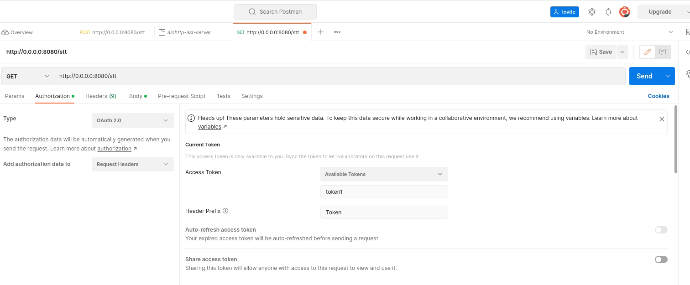

:og:description: Whipser based speech recognition authenticated aiohttp server
:og:keywords: whisper, speech recognition, authentication, server, client, python, ayoub malek, blog post
:og:image: ../../../../_static/meta_images/whisper_authenticated_aiohttp_server_with_token.png
:og:image:alt: whisper_authenticated_aiohttp_server_with_token

Token authenticated whisper based speech recognition aiohttp server
===================================================================

.. post:: December 27, 2022
   :tags: Python, Server-client, Speech recognition, Whisper
   :category: Server-client
   :author: Ayoub Malek
   :location: Munich
   :language: English

-----------------------

In the last blog post: `Token authenticated aiohttp server`_, an authenticated aiohttp server was introduced. 
In this post, we build on top of the previous posts, to create an Automatic Speech Recognition (ASR) authenticated server, that uses the newly introduced `whisper`_ by OpenAI_.

Speech recognition implementation
~~~~~~~~~~~~~~~~~~~~~~~~~~~~~~~~~
There are different approaches to implement this. The choice here is arbitrary, I chose whisper since it is accurate and simple to integrate.
One way to implement this is to use the whisper transcribe function. This can be done as follows:

.. code-block:: python
 :caption: transcribe
 :linenos:

  import io
  import sys
  import time
  import asyncio
  import logging
  import whisper
  import subprocess
  import soundfile as sf

  # load model 
  model = whisper.load_model("base")

  async def stt(request):
      """
      Speech to text routine to transcribe incoming wave audio and deliver
      the resulting text in return.

      Args:
          request.

      Returns:
          Json response.
      """
      response = {}
      stime = time.time()
      bytes_data = await request.content.read()
      logger.debug("size of received bytes data: " + str(sys.getsizeof(bytes_data)) + " bytes")

      try:
          # save temp file
          audio, fs = sf.read(io.BytesIO(bytes_data), dtype="float32")
          result = model.transcribe(audio=audio)
          texts = result['text'] 
          tproc      = round(time.time() - stime, 3)
          response   = {"text": ' '.join(texts), "proc_duration": tproc, "status": "success"}
      
      except Exception as e:
          response   = {"Error": str(e), "status": "failed"}
          logger.error("-> Errror :" + str(e))

      return web.json_response(response)

The config
~~~~~~~~~~
We will be using the same config specified in `Token authenticated aiohttp server/config`_
*Note the allowed_tokens sections, that can be replaced by your own server allowed tokens.*

Code
~~~~
The previously listed steps, should look together in Python as follows:

.. code-block:: python
  :linenos:

  import io
  import sys
  import json
  import time
  import asyncio
  import logging
  import whisper
  import subprocess
  import soundfile as sf
  from aiohttp import web
  from typing import Callable, Coroutine, Tuple

  # init loggging
  logger = logging.getLogger(__name__)
  logging.basicConfig(format="[%(asctime)s.%(msecs)03d] p%(process)s {%(pathname)s: %(funcName)s: %(lineno)d}: %(levelname)s: %(message)s", datefmt="%Y-%m-%d %p %I:%M:%S")
  logger.setLevel(10)

  # load model 
  model = whisper.load_model("base")

  # parse conf
  with open("config.json", "rb") as config_file:
      conf = json.loads(config_file.read())

  def ping(request):
      logger.debug("-> Received PING")
      response = web.json_response({"text": "pong", "status": "success"})
      return response

  async def stt(request):
      """
      Speech to text routine to transcribe incoming wave audio and deliver
      the resulting text in return.

      Args:
          request.

      Returns:
          Json response.
      """
      response = {}
      stime = time.time()
      bytes_data = await request.content.read()
      logger.debug("size of received bytes data: " + str(sys.getsizeof(bytes_data)) + " bytes")

      try:
          # save temp file
          audio, fs = sf.read(io.BytesIO(bytes_data), dtype="float32")
          result = model.transcribe(audio=audio)
          texts = result['text'] 
          tproc      = round(time.time() - stime, 3)
          response   = {"text": ' '.join(texts), "proc_duration": tproc, "status": "success"}
      
      except Exception as e:
          response   = {"Error": str(e), "status": "failed"}
          logger.error("-> Errror :" + str(e))

      return web.json_response(response)

  def token_auth_middleware(user_loader: Callable,
                      request_property: str = 'user',
                      auth_scheme: str = 'Token',
                      exclude_routes: Tuple = tuple(),
                      exclude_methods: Tuple = tuple()) -> Coroutine:
    """
    Checks a auth token and adds a user from user_loader in request.
    """
    @web.middleware
    async def middleware(request, handler):
        try               : scheme, token = request.headers['Authorization'].strip().split(' ')
        except KeyError   : raise web.HTTPUnauthorized(reason='Missing authorization header',)
        except ValueError : raise web.HTTPForbidden(reason='Invalid authorization header',)
              
        if auth_scheme.lower() != scheme.lower():
            raise web.HTTPForbidden(reason='Invalid token scheme',)

        user = await user_loader(token)
        if user : request[request_property] = user
        else    : raise web.HTTPForbidden(reason='Token doesn\'t exist')
        return await handler(request)
    return middleware

  async def init():
    """
    Init web application.
    """
    async def user_loader(token: str):
      user = {'uuid': 'fake-uuid'} if token in conf["server"]["http"]["allowed_tokens"] else None
      return user

    app = web.Application(client_max_size=conf["server"]["http"]["request_max_size"],
                  middlewares=[token_auth_middleware(user_loader)])
    
    app.router.add_route('GET', '/ping', ping)
    app.router.add_route('GET', '/stt', stt)
    return app

  if __name__ == '__main__':
    web.run_app(init(),)
    

Testing
~~~~~~~~
The previous code when executed will start a server running on :code:`http://localhost:8080/`.
To test your server, you can use curl_  :code:`curl -H 'Authorization: Token token1' http://localhost:8080/ping` (note that you will need to pass a token as specified in the config and code). 
As for the transcription function, this can be tested by passing the audio file to transcribe using :code:`curl -X POST --data-binary @WAVEFILENAME.wav http://127.0.0.1:8080/stt`.

Alternatively, you can use Postman_, which is a tool for developers to design, build and test their APIs.
For this, you will need to create you GET request, specify the API/server link, add your wave file to transcribe to the body (as binary) and you will need to specify your token in the headers.
This can be done under the authorization tab, choose OAuth 2.0 as type, then set the "Access Token" to an allowed token (specify this in the config)
"Header Prefix" to Token (this is the same as defined in :code:`def token_auth_middleware(.. auth_scheme: str = 'Token'..)`).

|

   Figure 20: Postman authorization config

|

The server reponses should look as follows: 

- Ping response: {"text": "pong", "status": "success"}
- Stt response: {"text": "transcription", "proc_duration": 0.xxx , "status": "success"}

Conclusion
~~~~~~~~~~
This blog built on top of the previous posts (`Basic aiohttp server`_ and `Token authenticated aiohttp server`_) to deliver an ASR authenticated server based on whisper_.

Share this blog
~~~~~~~~~~~~~~~~

.. raw:: html

  

    <a class="facebook" href="https://www.facebook.com/share.php?u=https://superkogito.github.io/blog/2022/12/27/whisper_aiohttp_server_with_token.html&title=whisper%20aiohttp%20server%20with%20token"                target="blank"><i class="fa fa-facebook"></i></a>
    <a class="twitter"  href="https://twitter.com/intent/tweet?url=https://superkogito.github.io/blog/2022/12/27/whisper_aiohttp_server_with_token.html&text=whisper%20aiohttp%20server%20with%20token"                 target="blank"><i class="fa fa-twitter"></i></a>
    <a class="linkedin" href="https://www.linkedin.com/shareArticle?mini=true&url=https://superkogito.github.io/blog/2022/12/27/whisper_aiohttp_server_with_token.html&title=whisper%20aiohttp%20server%20with%20token" target="blank"><i class="fa fa-linkedin"></i></a>
    <a class="reddit"   href="http://www.reddit.com/submit?url=https://superkogito.github.io/blog/2022/12/27/whisper_aiohttp_server_with_token.html&title=whisper%20aiohttp%20server%20with%20token"                    target="blank"><i class="fa fa-reddit"></i></a>
  

.. update:: 27 Dec 2022

   👨‍💻 edited and review were on 27.12.2022

.. _OpenAI : https://openai.com/ 
.. _aiohttp : https://docs.aiohttp.org/en/stable/
.. _curl : https://curl.se/
.. _whisper : https://github.com/openai/whisper
.. _Postman : https://www.postman.com/
.. _`Token authenticated aiohttp server` : https://superkogito.github.io/blog/2021/12/31/aiohttp_server_with_token.html
.. _`Basic aiohttp server` : https://superkogito.github.io/blog/2021/12/31/aiohttp_server_with_token.html 
.. _`Token authenticated aiohttp server/config` : https://superkogito.github.io/blog/2021/12/31/aiohttp_server_with_token.html#implementation